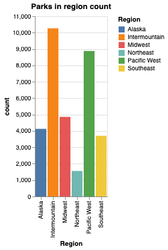

# Final Project Proposal

**GitHub Repo URL**: https://github.com/CMU-IDS-Spring-2025/final-project-s25-parkrangers/blob/main/Proposal.md

<!-- A short summary (3-4 paragraphs, about one page) of the data science problem you are addressing and what your solution will address. Feel free to include a figure or sketch to illustrate your project.

Each group should submit the URL pointing to this document on your github repo. -->

# National Parks Visitation Analysis and Recommendation System

## Group members: 
Aditi Saini, Ananya Angadi, Mahita Kandala, Rupsa Dhar

## Problem Statement

The US has a great variety of national parks with rich biodiversity. Each national park is known for its unique features. While some national parks remain popular tourist destinations, there are some that are underrated and need more attention. According to Strava, parks like North Cascades National Park, Washington and Isle Royal National Park, Michigan are top 2 places that are not as popular but are an “adventurer’s paradise”. There are websites that provide suggestions on which parks to visit, but none allow users to filter based on their specific criteria and offer personalized recommendations tailored to their preferences.

The aim of this project is to use datasets of national parks in the U.S. to gain insights into their unique features, biodiversity, climate change and visitor trends, ultimately helping users make informed decisions about which parks to visit based on their preferences. This will not only boost the popularity of underrated national parks but also align more closely with users' preferences. Additionally, it will encourage them to explore parks that are less crowded and off the beaten path. 

## Proposed Solution 

The clear problem statement for this project is to create a recommender system for users who are looking to explore national parks based on their trip preferences and interests. We will be focusing on Content based filtering methods to give a soft match based on user information like location, weather, season, trip type, biodiversity and finally whether the user wants to explore popular or underrated places. Additionally, we will incorporate interactive visualizations to help users select and refine their preferences for the parks they wish to visit. 

## Primary Dataset 

We plan to use the [U.S. National Park Visit Data (1979-2023)](https://www.responsible-datasets-in-context.com/posts/np-data/?tab=explore-the-data) for our project, which contains monthly visitation numbers and details for US National Parks between 1979 and 2023. It also categorizes visits based on the visit type (recreational, non-recreational, camping trip, etc.).  

To serve our purpose of recommending national parks to visit based on location and season, we plan to augment our data with [weather information](https://www.ncei.noaa.gov/cdo-web/datasets) to enable weather-based analysis and modelling. For example, some national parks may be more popular than others in the winter. Moreover, incorporating weather information will provide insights on how climate change has affected visitation numbers. 

We will also augment our dataset with [national park location data](https://www.kaggle.com/datasets/aliamini587/biodiversity-in-national-parks) to enable geospatial analysis, and data related to [park biodiversity](https://www.kaggle.com/datasets/nationalparkservice/park-biodiversity?select=species.csv) for richer visualizations. 

## Sketches and Data Analysis

# Data Processing. 
1. Do you have to do substantial data cleanup? 
Ans: We have not done any substantial 

2. What quantities do you plan to derive from your data? 
Ans: 

3. How will data processing be implemented?  

4. Show some screenshots of your data to demonstrate you have explored it.

# System Design. 
1. How will you display your data? What types of interactions will you support? 
2. Provide some sketches that you have for the system design.