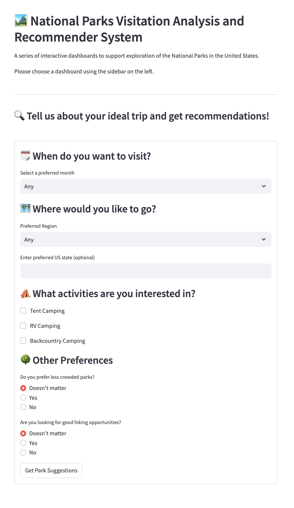

# National Park Visitation Analysis & Recommender System


## Instructions to run locally

```bash
python3 -m venv venv  
source venv/bin/activate  
pip install --upgrade pip  
pip install -r requirements.txt  
streamlit run ./Park_Rangers.py  
```

## Abstract

US National Parks are rich areas of biodiversity conservation and tourism. However, some parks are more well-known, and receive greater visitation on average. Hence, there is a need to bridge the gap, and boost the visitation numbers of less-frequented parks. To address this, we have built an interactive Streamlit dashboard combining visitation analysis with a questionnaire-guided recommendation system. Our goals are to provide a unified portal to explore everything US National Parks-related. We facilitate park comparisons based on several metrics, enable users to easily locate nearby airports, offer weather trends and biodiversity information to aid in decision making. We also highlight overall trends to support policymakers. Lastly, we have incorporated a questionnaire-driven clustering algorithm, to help users find parks that align with their preferences.

To do this, we have integrated data from several sources - national park visitation numbers, historical weather data, geospatial and airports-related information, as well as biodiversity data. We then used Altair and Plotly to present this data in an interactive and user-friendly format. We also built a simple K-Means clustering algorithm to help users find parks they will enjoy visiting. Future work includes social media sentiment analysis, dynamic clustering based on real-time weather, and incorporating socio-economic accessibility factors.

## Summary Image
The National Park Clustering workflow is implemented in Park_Rangers.py, where you can view the clustering logic, feature processing, and related visualizations.

<p align="left">
  
  <br>
  <strong>The Recommendations Based on User Responses</strong>
  <br>
  <br>
</p>

## Links
You can view the demo video below to see the project in action.
- [Demo Video](https://drive.google.com/file/d/1JbkVSzpqqGHfC3Mc_M_1BUze4MjxiZL_/view?usp=sharing)


## Project Process

This project taught us the value of collaboration, communication, and team bonding. We effectively resolved conflicts by listening and aligning on shared goals. Working together on data integration, visualization, and recommendations strengthened our teamwork. The experience not only enhanced our technical skills but also our ability to work cohesively as a unit.
