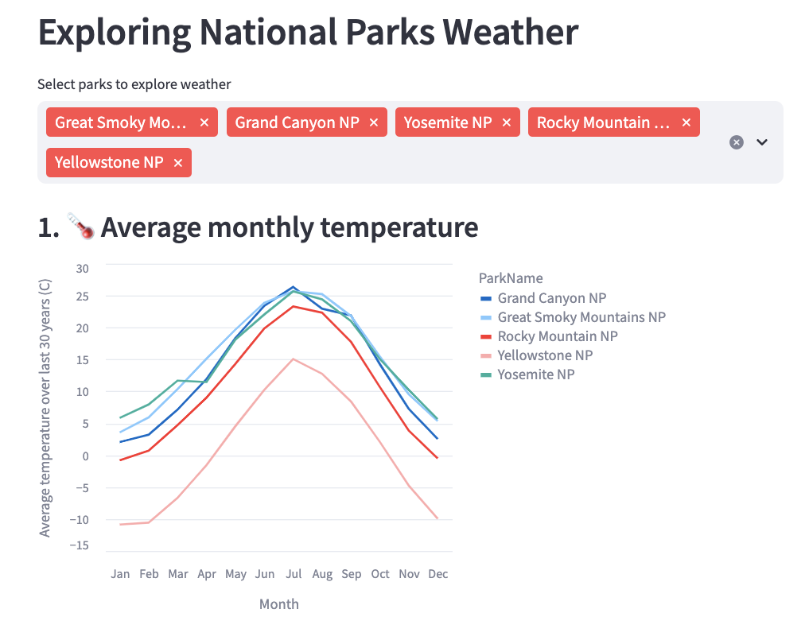
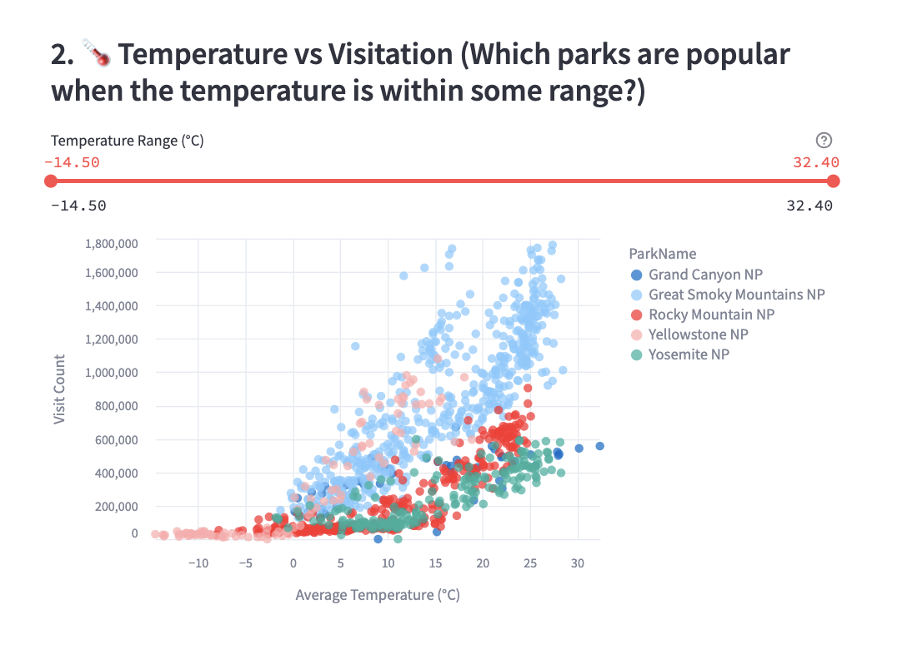
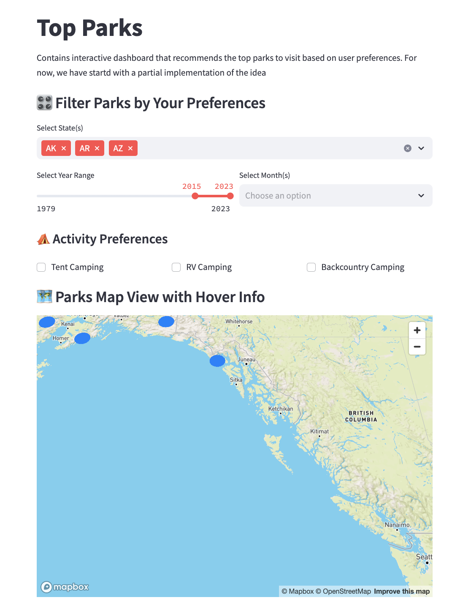
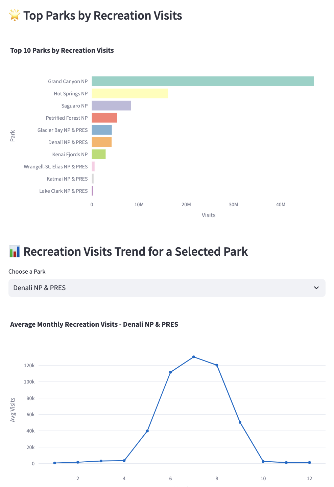
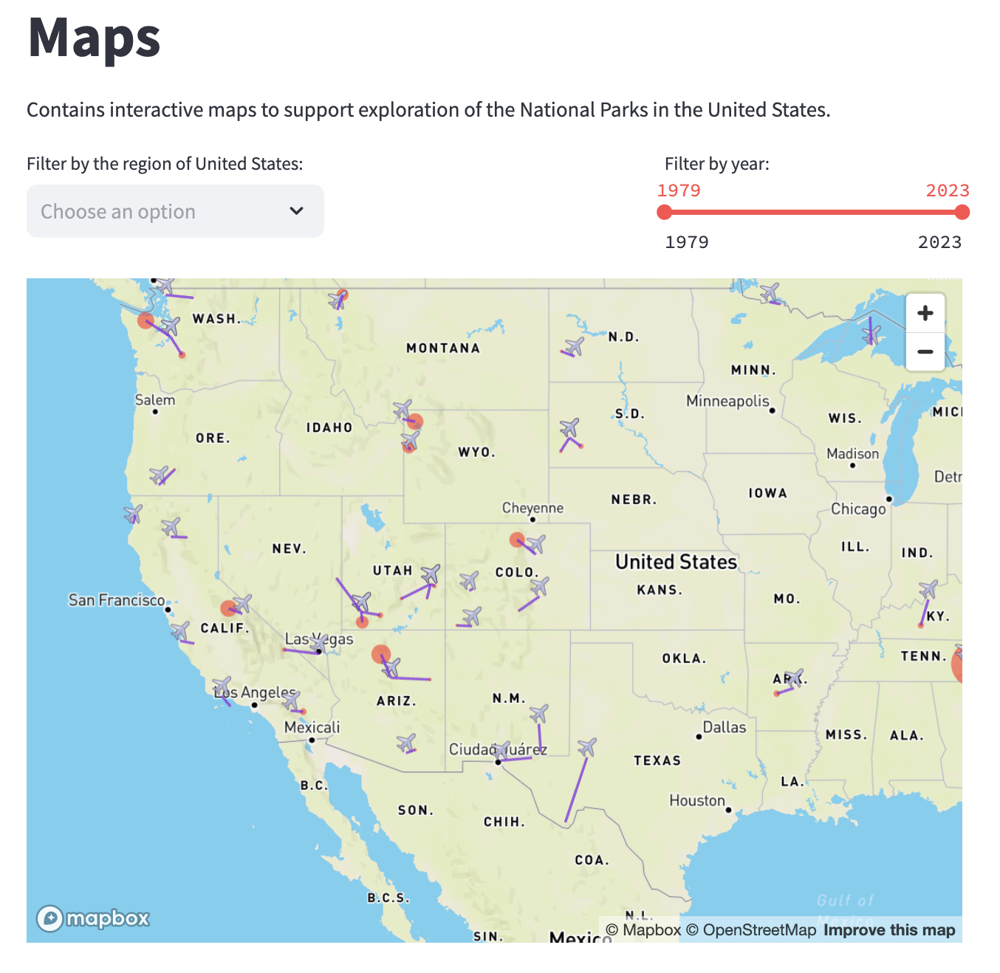

# Final Project Report

**Video URL**: https://drive.google.com/file/d/1JbkVSzpqqGHfC3Mc_M_1BUze4MjxiZL_/view?usp=sharing

## Introduction
National parks are essential for conserving the biodiversity and natural heritage of a country, while also offering recreational and educational opportunities to the general public. 
US National Parks however, suffer from skewed visitation distributions as is evidenced by the visitation numbers in the popular parks, and under-utilization of the lesser-known parks [1]. 
To address this, we have built an interactive dashboard that combines interactive national parks visitation analysis with a questionnaire-guided recommendation system. We hope to achieve the following goals through our work:
1. Provide prospective visitors and policymakers a comprehensive overview of US national parks, both as an information source and as a decision-making tool.  
2. Allow visitors to compare parks and easily discern similarities and differences.  
3. Allow policymakers to observe trends and changes in visitor behavior over the past 30+ years to aid in national parks-related policymaking.  
4. Promote visitation to less-explored national parks by highlighting their salient features and offering them as alternatives to similar but overcrowded parks.  
5. Help visitors discover parks aligned with their preferences via a questionnaire-driven clustering algorithm.  

## Related Work

#### 1. Visitation Pattern Analysis
Lacher and Brownlee studied trends in dispersion of park visitation using the Gini index (a measure of inequality derived from economics) [1]. Their work uncovered the persistent clustering among parks. Ideal conditions such as easy accessibility and pleasant weather made a few parks like the Great Smoky Mountains disproportionately popular. While this bodes well economically for communities near these popular parks, it can impact the environment negatively. At the same time, the more remote parks like North Cascades remain underutilized.

This work highlights the need for two efforts -
**a)** More awareness as to why certain destinations remain underutilized, thus enabling policymakers to craft strategies that improve their visibility and accessibility.
**b)** Directing visitor attention toward under-explored parks.

#### 2. Park Recommendation System
Wang et al. proposed a parks recommendation method based on content filtering using the Latent Dirichlet Allocation (LDA) model [2]. We aim to build on this by adding user preferences through a hybrid clustering algorithm. This approach allows the  identification of similar parks using a simple clustering recommendation system using static form input.

## Methods
#### Data
##### Primary Dataset
[U.S. National Park Visit Data (1979-2023):](https://www.responsible-datasets-in-context.com/posts/np-data/?tab=explore-the-data) This dataset, originally compiled by the National Park Service (NPS), contains monthly visitation details for US National Parks between 1979 and 2023. It also categorizes visits based on the visit type (recreational, non-recreational, camping trip, etc.).
##### Secondary Dataset
To serve our purpose of recommending national parks to visit based on location and season, we augmented our data with several other sources. We used the [National Oceanic and Atmospheric Administration (NOAA’s)](https://www.ncei.noaa.gov/cdo-web/) weather information data along with the [Meteostat](https://meteostat.net/en/) library in Python to enable weather-based analysis and modelling.
To incorporate biodiversity information, we used the [species data](https://www.kaggle.com/datasets/nationalparkservice/park-biodiversity) collected by the National Park service. It also contained the geospatial data we needed for location-based analysis and to produce map-based visualizations.
Lastly, to determine the closest airport to each national park and provide supporting visualizations, we used the [airports dataset](https://www.kaggle.com/datasets/aravindram11/list-of-us-airports/data).
##### Visualizations
We developed our application using Streamlit, leveraging Altair and Plotly for creating interactive visualizations. For mapping, we utilized Pydeck, which enabled us to incorporate multiple layers—allowing distinct visual representations for each national park, nearby airports, and suggested travel paths. Each UI component was added using the streamlit’s components like multiselect, slider, select_slider etc. In this way, these libraries allowed us to create our dashboard. 
##### Clustering Algorithm
To power our National Park Recommendation System, we performed clustering based on a combination of features derived from all three of our datasets: national park, airport, and weather. We aggregated and normalized visitation based columns (for example: RecreationalVisits column), average weather condition columns (for example: MinTemp, AvgTemp and MaxTemp columns), and distance to the nearest airport column. Using these features, we applied a clustering algorithm, K-Means clustering to group parks into similar clusters. These clusters were then ultimately utilized to find the top 5 recommendations for the users.

## Results
The ParkRangers dashboard is designed as a go-to destination for anyone looking to explore U.S. national parks based on personal preferences. It presents a wide range of information, including weather conditions, visitor trends, seasonal popularity across temperature bands, nearest airports, and top park recommendations based on activity interests. 

<u>Case study:</u> Sam is looking to visit a national park in the West coast of the US with his family. Sam has a keen interest in camping and prefers a relatively warmer park with a temperature of about 60 Fahrenheit in early summer. He wants to go to a park that is famous for its biodiversity and within driving distance to an airport. 

Our dashboard is divided into three pages. (1) ParkRangers homepage that serves as a recommendation page for the users, (2) Top Parks page that shows general trends and visualizations about the national parks using a filtering based approach, (3) Map page that shows all the parks and their nearest airport in an interactive map and (4) Weather page that shows weather and temperature data for different months and seasons for each national park. 

Here are a few visualizations that our dashboard provides that can help Sam make a more informed decision. 

  
   
  <strong>Personalized recommendation page</strong>
   
   

This page allows Sam to input key preferences and characteristics he is seeking in a national park. Based on this input, our backend uses a soft-match clustering algorithm to recommend parks that closely align with his criteria, even if not an exact match—ensuring flexible, personalized suggestions.

  
   
  <strong>Average monthly Temperature</strong>
   
   

  
   
  <strong>Temperature vs Visitation</strong>
   
   

These visualizations help Sam identify one or more national parks that align with his preferences by providing insights into average monthly temperature trends across different times of the year. This is especially valuable for Sam, as it allows him to find parks that meet his specific climate requirements for an enjoyable trip.

  
   

  
   

The Explore page also enables users to discover parks through an intuitive, filter-based interface. By selecting activity preferences, desired month, and activity type, users can explore parks based on historical visitation patterns and weather data. This feature allows Sam to better understand seasonal trends and activity suitability before finalizing his travel plans.

  
   

Lastly, the Map page allows users to explore each national park’s visitation patterns by region and year range through an interactive map. It also highlights the nearest airport to each park, helping users like Sam plan convenient travel routes and assess accessibility when selecting their destination.

In this way, the dashboard thoughtfully integrates features that cater to the needs of users like Sam, supporting informed, personalized trip planning for visits to national parks across the U.S.

## Discussion

Our National Parks Visitation Analysis and Recommender System helps users gain a more nuanced understanding of the distinguishing features of U.S. national parks. By allowing visitors to input their preferences—such as time of visit, region, desired activities, and interest in hiking—the system delivers personalized park recommendations. This enables users to approach park selection through a data-driven lens rather than relying solely on anecdotal sources or generic travel guides.
Through interactive visualizations, users gain insights into how climate influences park visitation trends. For instance, the “Temperature vs. Visitation” charts reveal that parks with moderate summer temperatures tend to attract more visitors, while parks in colder climates see a steep drop in attendance during winter months. Additionally, users can see which parks are most suitable for their preferred activities, such as tent camping, RV camping, or backcountry hiking—information that might otherwise require extensive research.

The dashboard also introduces new practices in trip planning. By providing a heatmap of monthly visits by state and showing the best months to visit each park, the system helps users optimize the timing of their trips. This enables more efficient travel planning, especially for those looking to avoid crowds or visit parks during peak scenic periods. Moreover, the map-based view encourages exploration of lesser-known parks that align with user interests but receive fewer visitors, thus promoting equitable distribution of tourism.

Informal observations suggest the interface is intuitive and engaging. Users often explore multiple input combinations out of curiosity, indicating that the system encourages interactive learning. Families planning vacations, avid hikers looking for challenging trails, or educators demonstrating real-world applications of data visualization all find value in the tool. By presenting complex visitation and environmental data in an accessible format, the system not only supports better travel decisions but also fosters deeper appreciation for the diversity and richness of U.S. national parks.

## Future Work
There are several aspects of national park visitation that can be further explored, such as:

#### 1. Social-media sentiment analysis
Social media posts have become a rich source to understand user sentiment about a specific topic, including the popularity of national parks. We could use geotagged data, along with BERT-based sentiment analysis on park reviews to understand emerging visitation patterns.

#### 2. Dynamic clustering adaptation
We could incorporate real-time weather data to dynamically decide which parks are currently safe for visitation. We could also offer alternatives by recommending other parks from the same cluster. For example, during California wildfires, we could redirect Yosemite visitors to less smoky parks like Redwood or Lassen. We could also extend our Streamlit application to provide weather alerts (based on NOAA storm warnings) and information about road closures in and around parks.

#### 3. Incorporating Socio Economic Accessibility Factors
As part of the future work, we could also factor in ticket pricing and urban proximity metrics to address economic barriers to higher visitation. For example, Schill et al.’s analysis [3] of how visitation numbers correlate with ticket prices showed that just a 10% increase in admission fee could lead to a 3-5% decline in visits by lower-income groups. 

Hence, we need to incorporate hybrid metrics that would balance affordability and accessibility while recommending parks. This information would also aid policymakers in pricing decisions so as to promote visitation while simultaneously maintaining conservation goals.

## References
[1] Lacher, R. Geoffrey, and Matthew TJ Brownlee. "Determinates of clustering across America's national parks: An application of the Gini coefficients." In: Fisher, Cherie LeBlanc; Watts, Clifton E., Jr., eds. Proceedings of the 2010 Northeastern Recreation Research Symposium. Gen. Tech. Rep. NRS-P-94. Newtown Square, PA: US Department of Agriculture, Forest Service, Northern Research Station: 183-188.. 2012.

[2] Wang, Chunxu, et al. "Park recommendation algorithm based on user reviews and ratings." International Journal of Performability Engineering 15.3 (2019): 803.

[3] Schill, Emily Claire. "The Price of Public Land: An Analysis of Visitor Responsiveness to National Park Entrance Fees." (2019).
